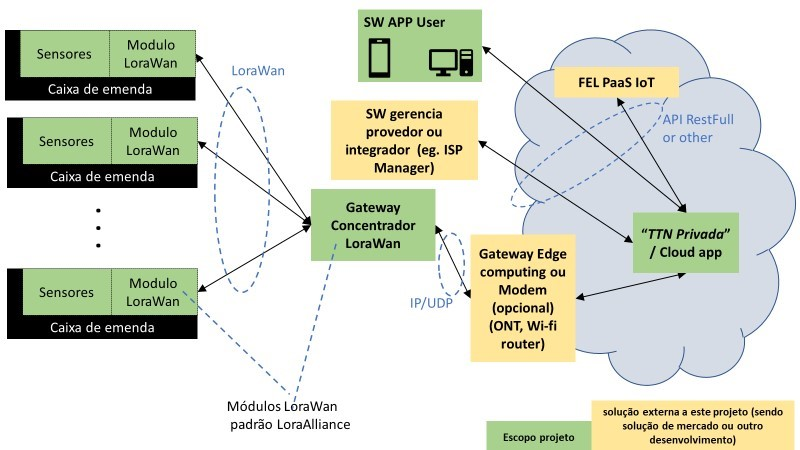

# Sensoriamento para Caixa de Emenda

## Pacotes
- C
- C++
- Python
- JavaScript
- HTML

## Objetivo
As caixas de emenda de fibras ópticas, por se localizarem em postes ou cordoalha e à vista, são alvo de furtos frequentes em redes ópticas de telecomunicações. 
Quando retiradas, a conexão das operadoras com seus clientes é perdida. A detecção da ausência da caixa acontece apenas através de notificações de assinantes que 
perdem o serviço, assim, a identificação do local e reestabelecimento da conexão demoram a acontecer. Este projeto visa modificar este cenário oferecendo tanto a operadoras como a provedores de internet uma solução para rápida identificação e reposição de caixas de emenda ópticas em casos de furto. 
O projeto consiste em um sistema IoT que irá se comunicar com o protocolo e arquitetura de rede LoRaWAN.

## Visão sistemica
O sistema consiste no desenvolvimento de um sensor IoT conectado a um gateway LoRaWAN e um software em nuvem (TTN Privado). E para administração do sistema, 
monitoramento e visualização dos dados será um utilizado um aplicativo, o qual poder um app móvel ou um dashboard desktop, onde apenas uma prova de conceito será 
exigida nesta fase do projeto. A figura abaixo ilustra uma visão sistêmica da solução.

## Etapas do projeto

### Setup do projeto
- Definição das equipes e ambientes de desenvolvimento
- Montagem do ambiente (compra de equipamentos)
- Pesquisas, estudos e aculturamento sobre as APIs (p. ex TTN, AWS) e obtenção de informações/esclarecimentos sobre o projeto.

### Estudo Endpoint, Gateway e UI
- Detalhamento dos requisitos funcionais e não funcionais.
- Definição da arquitetura de hardware e periféricos.
- Definição da arquitetura de software.

### Desenvolvimento HW, FW, SW
-  Dimensionamento do Hardware, componentes 
- Esquema elétrico e layout
- Prototipação e Depuração
- Criação de FW Endpoint (device drivers, etc)
- Desenvolvimento de Funcionalidades Específicas (regras de negócio, detecção de movimento, etc)
- Criação FW Gateway 
- Criação de chamadas de API 
- Implementação SW Mobile ou Web page para consumo de API
- Integração HW + FW Endpoint + FW Gateway + SW

### Documentação e transferência de tecnologia
- Entrega: Sensor em PCB. Esta solução que será apresentada no POC; 
- Entrega: Desenho da placa para o protótipo 1 pronto para a produção em Centro de Montagem. 
- Entrega: Gateway com HW/SW funcional
- Entrega: Tela em HTML e/ou APP mobile que se comunique com o gateway e realize as funcionalidades básicas. 
- Entrega: Demonstração de integração com a AWS utilizando conta Furukawa. Esta etapa deverá ser acompanhada por a equipe de desenvolvimento da Furukawa. 
- Entrega: Testes funcionais da solução fim a fim (PoC).
- Entrega: Documentação via WIKI/TRAC e controle das versões (p. ex SVN) nos servidores da Furukawa Electric.
- Entrega: Realização de reunião técnica para apresentação e transferência da tecnologia.
- Entrega: Suporte de uso da API a equipe de desenvolvimento da plataforma FEL PaaS IoT.

